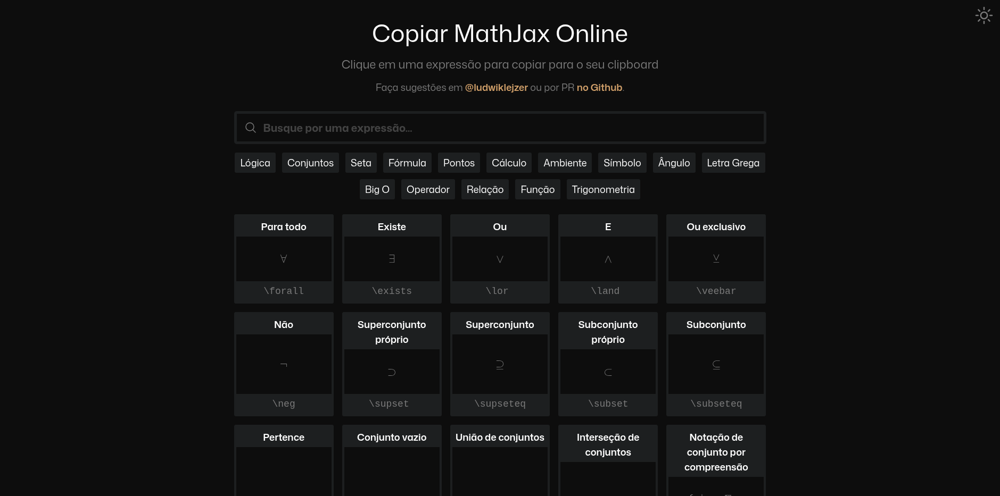

# Copiar MathJax Online

Este é um projeto de estudo e prática de React.js, replicando o design e as funcionalidades do site [copypastemathjax.com](https://copypastemathjax.com). A ideia principal é fornecer uma ferramenta simples e eficiente para copiar e colar expressões matemáticas formatadas em LaTeX/MathJax.

A principal funcionalidade adicional implementada neste projeto, que não existe na versão original, é a opção de alternar entre o tema claro e escuro.



---

## Funcionalidades

- **Busca Instantânea** por nome das expressões
- **Filtragem por Categorias** (e.g., `Teoria dos Conjuntos`, `Setas`, `Cálculo`, etc.)
- **Cópia com um clique** das fórmulas LaTeX para o gerenciador de clipboard
- **Tema Dark e Light** com persistência em localStorage
- Suporte a renderização **MathJax/KaTeX** através da lib `react-katex`
- Design totalmente **responsivo**

---

## Demo

[Clique para ver online](https://copiar-mathjax-online.vercel.app/)

---

## Como Executar o Projeto

### Requisitos

- Node.js ≥ 23
- npm or yarn

### Instalação

```bash
git clone https://github.com/ludwiklejzer/copiar-mathjax-online.git
cd copiar-mathjax-online
npm install
npm run dev
```
